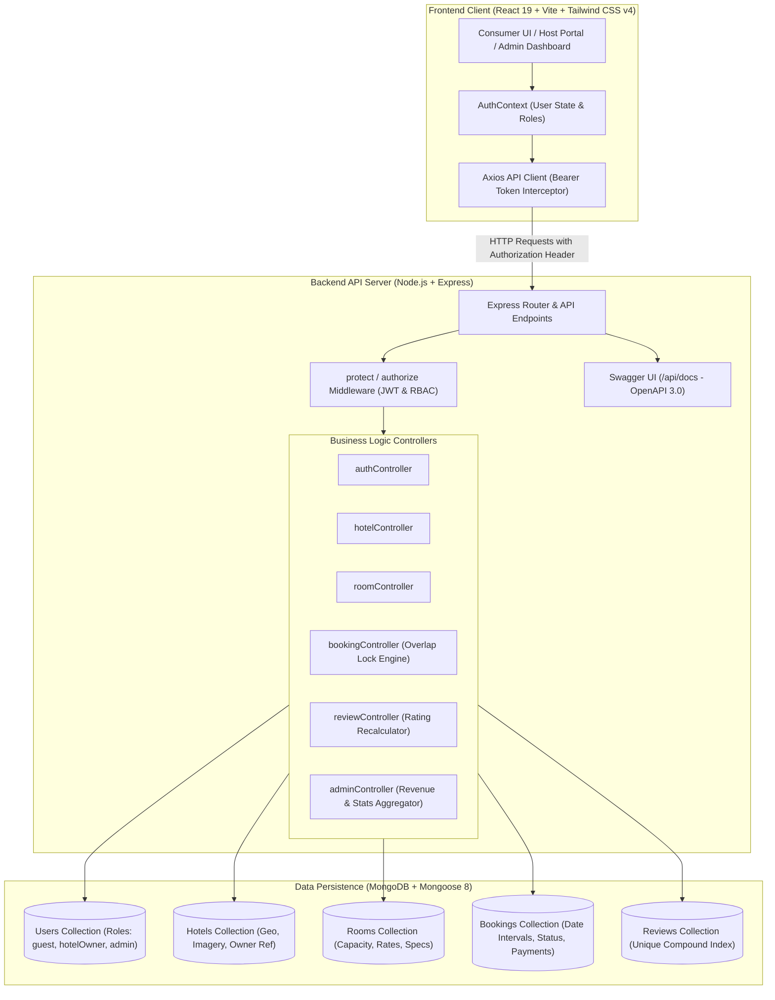

# Manzil (منزل) — Enterprise Pakistani Hospitality & Hotel Reservation Platform

[](https://react.dev/)
[](https://nodejs.org/)
[](https://expressjs.com/)
[](https://www.mongodb.com/)
[](https://tailwindcss.com/)
[](https://redux-toolkit.js.org/)
[](https://swagger.io/)
[](https://jwt.io/)
[](https://fontawesome.com/)
[](https://nodemailer.com/)

**Manzil (منزل)** is a production-grade, full-stack MERN hotel booking and hospitality operations platform celebrating authentic Pakistani luxury and culture across Islamabad, Lahore, Karachi, Murree, Swat, and Hunza. Engineered with **React 19**, **Redux Toolkit (RTK)**, **Tailwind CSS v4**, **Node.js/Express**, and **MongoDB (Mongoose 8)**, it bridges consumer-facing reservations in PKR with an enterprise-tier Host Management Console and a SuperAdmin Control Portal.

The platform is designed with senior architectural principles: **centralized Redux Toolkit state management with async thunks**, **atomic date-overlap reservation locks**, **stateless JWT authentication with role-based access control (RBAC)**, **Swagger OpenAPI 3.0 documentation**, and **MongoDB aggregation pipelines for financial intelligence**.

🔗 **Live Demo**: [https://manzil-zbob.vercel.app/](https://manzil-zbob.vercel.app/)
🔗 **Live API**: [https://manzil-liart.vercel.app/](https://manzil-liart.vercel.app/)

---

## 📑 Table of Contents

- [Executive Overview & Key Highlights](#-executive-overview--key-highlights)
- [System Architecture & Data Flow](#-system-architecture--data-flow)
- [Multi-Tier Role Capabilities](#-multi-tier-role-capabilities)
- [Core Engineering Engines](#-core-engineering-engines)
  - [Atomic Concurrency & Overlap Engine](#1-atomic-concurrency--overlap-engine)
  - [MongoDB Financial Aggregation Pipeline](#2-mongodb-financial-aggregation-pipeline)
  - [Auto-Recalculating Review Engine](#3-auto-recalculating-review-engine)
- [Default System Credentials](#-default-system-credentials)
- [Interactive API Documentation (Swagger)](#-interactive-api-documentation-swagger)
- [RESTful API Reference](#-restful-api-reference)
- [Project Directory Structure](#-project-directory-structure)
- [Installation & Getting Started](#-installation--getting-started)
- [Environment Configuration](#-environment-configuration)
- [Production Verification & Testing](#-production-verification--testing)
- [License & Authors](#-license--authors)

---

## 🌟 Executive Overview & Key Highlights

- **Consumer Reservation Experience**: Full-text location search, destination filters, date-range availability checks, price-tier sliders, amenity tagging, responsive image carousels, and instant voucher receipt generation with print capability.
- **Host Operations Portal**: Dedicated multi-tab host operations dashboard displaying property metrics, room inventory CRUD, active booking tracking, and property registration.
- **Platform SuperAdmin Portal**: High-level platform control center featuring 6-month revenue trends, live transaction feeds, user role management, listing moderation, and cascading deletion safeguards.
- **Interactive OpenAPI Specification**: Self-hosted Swagger UI at `/api/docs` exposing every endpoint with request/response schemas and JWT Bearer authorization testing.
- **Transactional Email Notifications**: Automated booking confirmation emails via Nodemailer with responsive HTML templates, pricing breakdowns, and Ethereal Email sandbox for development testing. Production-ready SMTP configuration.
- **Production Asset Pipeline**: Font Awesome 6.5.2 integrated via official SVG modules alongside Lucide React for crisp visual communication.

---

## 📐 System Architecture & Data Flow



---

## 👥 Multi-Tier Role Capabilities

| Role | Access Scope | Capabilities |
| :--- | :--- | :--- |
| **Traveler (Guest)** | Public & Consumer Pages | Search rooms, filter by dates/amenities, verify date availability, execute reservations, view digital vouchers, print receipts, submit verified reviews. |
| **Hotel Host (Owner)** | Host Dashboard (`/dashboard`) | View property revenue KPIs, list hotels, publish rooms with specs (sq ft, bed/bath count, nightly rates), toggle room availability, update reservation statuses (`completed`, `cancelled`). |
| **Platform Admin** | Admin Dashboard (`/admin`) | Platform overview, 6-month gross revenue visualization, search and modify user roles (`guest` / `hotelOwner` / `admin`), moderate/delete properties, manage global bookings, moderate reviews. |

---

## ⚙️ Core Engineering Engines

### 1. Atomic Concurrency & Overlap Engine

To eliminate race conditions and double-bookings when multiple travelers reserve the same suite simultaneously, the reservation engine executes atomic date interval overlap checks directly within MongoDB:

$$\text{Conflict} \iff (\text{checkInDate} < \text{requestedCheckOut}) \land (\text{checkOutDate} > \text{requestedCheckIn})$$

```javascript
// server/controllers/bookingController.js
const conflictingBooking = await Booking.findOne({
  room: roomId,
  status: { $in: ['confirmed', 'pending'] },
  checkInDate: { $lt: reqCheckOut },
  checkOutDate: { $gt: reqCheckIn },
});

if (conflictingBooking) {
  return res.status(409).json({
    success: false,
    message: 'Room is already reserved for the selected dates. Please choose different dates.',
  });
}
```

### 2. MongoDB Financial Aggregation Pipeline

The SuperAdmin analytics engine aggregates historical transactions to deliver month-by-month financial metrics and revenue velocity without client-side calculation overhead:

```javascript
// server/controllers/adminController.js
const monthlyRevenue = await Booking.aggregate([
  {
    $match: {
      status: { $ne: 'cancelled' },
      createdAt: { $gte: sixMonthsAgo },
    },
  },
  {
    $group: {
      _id: {
        year: { $year: '$createdAt' },
        month: { $month: '$createdAt' },
      },
      revenue: { $sum: '$totalPrice' },
      count: { $sum: 1 },
    },
  },
  { $sort: { '_id.year': 1, '_id.month': 1 } },
]);
```

### 3. Auto-Recalculating Review Engine

When a verified traveler posts or updates a review, a MongoDB aggregation pipeline recalculates the mean rating for the specific room and updates the room document atomically:

```javascript
// server/controllers/reviewController.js
const stats = await Review.aggregate([
  { $match: { room: roomObjectId } },
  {
    $group: {
      _id: '$room',
      avgRating: { $avg: '$rating' },
      reviewsCount: { $sum: 1 },
    },
  },
]);

await Room.findByIdAndUpdate(roomId, {
  rating: stats.length > 0 ? Number(stats[0].avgRating.toFixed(1)) : 5.0,
  reviewsCount: stats.length > 0 ? stats[0].reviewsCount : 0,
});
```

---

## 🔑 Default System Credentials

Pre-configured accounts for testing and evaluation across all platform roles:

| Role | Email | Password | Access Portal |
| :--- | :--- | :--- | :--- |
| **Platform Administrator** | `admin@manzil.pk` | `admin123` | [https://manzil-zbob.vercel.app/admin](https://manzil-zbob.vercel.app/admin) |
| **Verified Hotel Host** | `host@manzil.pk` | `password123` | [https://manzil-zbob.vercel.app/dashboard](https://manzil-zbob.vercel.app/dashboard) |
| **Traveler (Guest)** | `guest@manzil.pk` | `password123` | [https://manzil-zbob.vercel.app/my-bookings](https://manzil-zbob.vercel.app/my-bookings) |

---

## 📖 Interactive API Documentation (Swagger)

Manzil exposes a comprehensive, interactive OpenAPI 3.0 specification powered by `swagger-ui-express`:

- **Swagger Documentation URL**: [https://manzil-liart.vercel.app/api/docs](https://manzil-liart.vercel.app/api/docs)
- **Alternate Route**: [https://manzil-liart.vercel.app/api-docs](https://manzil-liart.vercel.app/api-docs)

From Swagger UI, you can:
1. Review all endpoint request/response JSON schemas.
2. Click **Authorize** and paste your JWT bearer token to test protected routes.
3. Execute live queries against hotels, rooms, bookings, and admin stats directly in the browser.

---

## 📡 RESTful API Reference

### Authentication & Profiles (`/api/auth`)
| Method | Endpoint | Access | Description |
| :--- | :--- | :--- | :--- |
| `POST` | `/api/auth/register` | Public | Register new guest or host account |
| `POST` | `/api/auth/login` | Public | Authenticate user & return JWT token |
| `GET` | `/api/auth/me` | Private | Retrieve authenticated profile |
| `PUT` | `/api/auth/profile` | Private | Update profile & upgrade to host |

### Hotel Properties (`/api/hotels`)
| Method | Endpoint | Access | Description |
| :--- | :--- | :--- | :--- |
| `GET` | `/api/hotels` | Public | List all hotels with city/text query |
| `GET` | `/api/hotels/my` | Private (Host) | List hotels owned by current host |
| `GET` | `/api/hotels/:id` | Public | Get single hotel details & rooms |
| `POST` | `/api/hotels` | Private (Host) | Register new hotel property |
| `PUT` | `/api/hotels/:id` | Private (Host) | Update owned hotel property |
| `DELETE`| `/api/hotels/:id` | Private (Host) | Delete hotel & cascade delete rooms |

### Rooms & Suites (`/api/rooms`)
| Method | Endpoint | Access | Description |
| :--- | :--- | :--- | :--- |
| `GET` | `/api/rooms` | Public | Search & filter rooms (city, type, price, guests, amenities) |
| `GET` | `/api/rooms/:id` | Public | Get room specifications, hotel info, and reviews |
| `POST` | `/api/rooms/:id/availability` | Public | Validate date-interval availability |
| `POST` | `/api/rooms` | Private (Host) | Publish a new room listing |
| `PUT` | `/api/rooms/:id` | Private (Host) | Edit room specifications or pricing |
| `DELETE`| `/api/rooms/:id` | Private (Host) | Remove room listing from inventory |

### Reservations & Bookings (`/api/bookings`)
| Method | Endpoint | Access | Description |
| :--- | :--- | :--- | :--- |
| `POST` | `/api/bookings` | Private | Create booking with date-overlap lock |
| `GET` | `/api/bookings/my` | Private | Get authenticated user's reservations |
| `GET` | `/api/bookings/owner` | Private (Host) | Get host property bookings & revenue |
| `PUT` | `/api/bookings/:id/cancel` | Private | Cancel reservation & release dates |
| `PUT` | `/api/bookings/:id/status` | Private (Host) | Update booking status (`completed`, `cancelled`) |

### Reviews & Ratings (`/api/reviews`)
| Method | Endpoint | Access | Description |
| :--- | :--- | :--- | :--- |
| `GET` | `/api/reviews/room/:roomId` | Public | Fetch reviews for a room |
| `POST` | `/api/reviews/room/:roomId` | Private | Submit/update verified review |

### Platform SuperAdmin (`/api/admin`)
| Method | Endpoint | Access | Description |
| :--- | :--- | :--- | :--- |
| `GET` | `/api/admin/stats` | Admin | Platform aggregates, 6-mo revenue, KPIs |
| `GET` | `/api/admin/users` | Admin | Search users, paginate, filter by role |
| `PUT` | `/api/admin/users/:id` | Admin | Update user role (`guest`, `hotelOwner`, `admin`) |
| `DELETE`| `/api/admin/users/:id` | Admin | Remove user account & clean up |
| `GET` | `/api/admin/hotels` | Admin | List all hotels across the platform |
| `DELETE`| `/api/admin/hotels/:id` | Admin | Cascading delete of hotel, rooms, bookings |
| `GET` | `/api/admin/bookings` | Admin | Global reservations feed with pagination |
| `PUT` | `/api/admin/bookings/:id` | Admin | Update booking status & payment state |
| `GET` | `/api/admin/reviews` | Admin | All platform reviews with pagination |
| `DELETE`| `/api/admin/reviews/:id` | Admin | Moderate/delete inappropriate review |

---

## 📁 Project Directory Structure

```
Hotel-Booking/
├── client/                                 # React 19 Frontend Application
│   ├── public/                             # Public static assets
│   ├── src/
│   │   ├── assets/                         # SVG icons, curated images, assets bundle
│   │   ├── components/                     # Reusable UI Components
│   │   │   ├── AuthModal.jsx               # Sign In / Register dialog with role selection
│   │   │   ├── BookingModal.jsx            # Checkout modal with payment card inputs
│   │   │   ├── ExclusiveOffers.jsx         # Curated luxury seasonal packages
│   │   │   ├── FeaturedDestinations.jsx    # Destination discovery with direct routing
│   │   │   ├── Footer.jsx                  # Brand footer with navigation & social links
│   │   │   ├── Navbar.jsx                  # Responsive nav with role badges & links
│   │   │   ├── RoomCard.jsx                # Suite card with pricing, rating & tags
│   │   │   └── Testimonials.jsx            # Verified traveler satisfaction section
│   │   ├── context/
│   │   │   └── AuthContext.jsx             # User state, JWT storage, role predicates
│   │   ├── pages/
│   │   │   ├── AdminDashboardPage.jsx      # SuperAdmin portal (6 management views)
│   │   │   ├── DashboardPage.jsx           # Host Operations console (4 views)
│   │   │   ├── HomePage.jsx                # Landing page with hero & search bar
│   │   │   ├── MyBookingsPage.jsx          # Traveler reservations & voucher receipts
│   │   │   ├── RoomDetailPage.jsx          # Room specs, gallery & booking trigger
│   │   │   └── RoomsPage.jsx               # Multi-filter search & catalog browser
│   │   ├── services/
│   │   │   └── api.js                      # Axios client with JWT interceptor & API methods
│   │   ├── App.jsx                         # Main router & toast notification setup
│   │   ├── index.css                       # Tailwind CSS v4 directives & font imports
│   │   └── main.jsx                        # React root entry point
│   ├── index.html                          # HTML shell with Font Awesome CDN & fonts
│   ├── package.json                        # Frontend dependencies
│   └── vite.config.js                      # Vite 8 configuration
│
├── server/                                 # Express & Node.js Backend API
│   ├── config/
│   │   ├── db.js                           # MongoDB connection handler
│   │   └── swagger.js                      # OpenAPI 3.0 specification definition
│   ├── controllers/
│   │   ├── adminController.js              # Platform stats, user/hotel/booking/review CRUD
│   │   ├── authController.js               # Registration, login, profile management
│   │   ├── bookingController.js            # Reservation engine with concurrency locks
│   │   ├── hotelController.js              # Hotel property management
│   │   ├── reviewController.js             # Verified reviews & rating recomputation
│   │   └── roomController.js               # Room inventory & availability checks
│   ├── middleware/
│   │   ├── authMiddleware.js               # JWT verification & RBAC authorization
│   │   └── errorMiddleware.js              # 404 handler & JSON error formatter
│   ├── models/
│   │   ├── Booking.js                      # Reservation schema & status enums
│   │   ├── Hotel.js                        # Hotel schema & owner relation
│   │   ├── Review.js                       # Review schema with unique compound index
│   │   ├── Room.js                         # Room schema with specs & amenities
│   │   └── User.js                         # User schema with bcrypt password hashing
│   ├── routes/
│   │   ├── adminRoutes.js                  # Protected /api/admin router
│   │   ├── authRoutes.js                   # /api/auth router
│   │   ├── bookingRoutes.js                # /api/bookings router
│   │   ├── hotelRoutes.js                  # /api/hotels router
│   │   ├── reviewRoutes.js                 # /api/reviews router
│   │   └── roomRoutes.js                   # /api/rooms router
│   ├── utils/
│   │   ├── createAdmin.js                  # Standalone admin user creation utility
│   │   ├── emailService.js                 # Nodemailer transactional email service
│   │   ├── seedData.js                     # Realistic luxury hotels & suites dataset
│   │   └── seedRunner.js                   # Automated database seeder
│   ├── package.json                        # Backend dependencies
│   └── server.js                           # Express application entry & middleware mount
│
├── .gitignore                              # Git exclusion rules
├── package.json                            # Root workspace with concurrent run scripts
└── README.md                               # Platform documentation
```

---

## 🚀 Installation & Getting Started

### Prerequisites

- **Node.js**: `v18.0.0` or higher (v20+ recommended)
- **npm**: `v9.0.0` or higher
- **MongoDB**: Local MongoDB instance running on `mongodb://127.0.0.1:27017` or MongoDB Atlas URI.

### 1. Clone the Repository

```bash
git clone https://github.com/your-username/Hotel-Booking.git
cd Hotel-Booking
```

### 2. Install Dependencies

Install root, client, and server dependencies with a single command:

```bash
npm run install:all
```

### 3. Environment Configuration

Create a `.env` file in the `server/` directory:

```env
# server/.env
PORT=5000
NODE_ENV=development
MONGO_URI=mongodb://127.0.0.1:27017/hotel_booking_db
JWT_SECRET=manzil_super_secret_jwt_key_2026_production
JWT_EXPIRE=30d
CLIENT_URL=https://manzil-zbob.vercel.app

# Email (optional — uses Ethereal Email sandbox if omitted)
SMTP_HOST=smtp.gmail.com
SMTP_PORT=587
SMTP_USER=your-email@gmail.com
SMTP_PASS=your-app-password
SMTP_FROM="Manzil Reservations" <reservations@manzil.pk>
```

*(Optional)* Create a `.env` file in the `client/` directory if connecting to a non-standard backend URL:

```env
# client/.env
VITE_API_URL=https://manzil-liart.vercel.app/api
```

### 4. Seed the Database

The backend automatically detects if the database is empty and seeds initial luxury properties, suites, and user accounts. To manually seed or reset the database:

```bash
# In the server directory
node utils/seedRunner.js

# Or initialize the system administrator account:
node utils/createAdmin.js
```

### 5. Launch the Platform

Run both client and server concurrently using the root runner for local development:

```bash
npm run dev
```

- **Frontend Client (Local)**: [http://localhost:5173](http://localhost:5173)
- **Backend Core API (Local)**: [http://localhost:5000/api](http://localhost:5000/api)

Or access the live deployed instances directly:

- **Frontend Client (Live)**: [https://manzil-zbob.vercel.app/](https://manzil-zbob.vercel.app/)
- **Backend Core API (Live)**: [https://manzil-liart.vercel.app/api](https://manzil-liart.vercel.app/api)
- **Interactive Swagger Docs (Live)**: [https://manzil-liart.vercel.app/api/docs](https://manzil-liart.vercel.app/api/docs)
- **API Health Check (Live)**: [https://manzil-liart.vercel.app/api/health](https://manzil-liart.vercel.app/api/health)

---

## 🧪 Production Verification & Testing

### Running Frontend Production Build

Verify that TypeScript/JSX and Tailwind CSS compile with zero warnings or errors:

```bash
cd client
npm run build
```

*Output:*
```
✓ 2006 modules transformed.
dist/index.html                     1.45 kB │ gzip: 0.82 kB
dist/assets/index-6qa9_ueS.css    145.73 kB │ gzip: 32.91 kB
dist/assets/index-7jrMfyh3.js     518.81 kB │ gzip: 147.99 kB
✓ built in 1.72s
```

### Testing the REST API with cURL / PowerShell

Against the live deployment:

```bash
# 1. Healthcheck
curl https://manzil-liart.vercel.app/api/health

# 2. Login as Administrator
curl -X POST https://manzil-liart.vercel.app/api/auth/login \
  -H "Content-Type: application/json" \
  -d '{"email":"admin@manzil.pk","password":"admin123"}'

# 3. Query Real-Time Platform Analytics (using token from step 2)
curl https://manzil-liart.vercel.app/api/admin/stats \
  -H "Authorization: Bearer <TOKEN>"
```

Against a local instance, replace the base URL with `http://localhost:5000`.

---

## 📄 License & Authors

This project is licensed under the **MIT License**. Engineered as a reference production architecture for luxury hospitality booking platforms.
